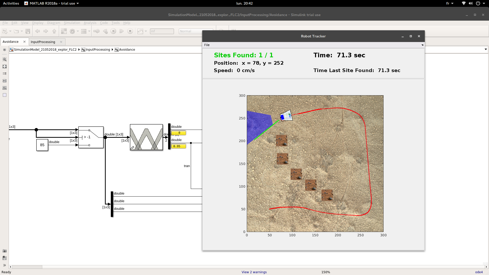

**Author :** [Zeryab Moussaoui](https://fr.linkedin.com/in/zeryab-moussaoui-9a728029)

# Fuzzy Robot Type2
This is an implementation of Fuzzy Logic Control Type 2 for Mobile Robot.
It is based on : 
* The [Mission On Mars Robot Challenge](https://fr.mathworks.com/academia/student-challenge/mission-on-mars.html) environement 
* The [IT2-FLS](https://github.com/zeryabmoussaoui/type-2-fuzzy-logic-systems-matlab-toolbox) library.

It performs Goal Reach to a defined landmark, with obstacle Avoidance.
Both functions are implented using Fuzzy LogiC Control type 1 or 2.

## Requirements

Warning for non-professionnal : this would be either expensive or illegal.
I hate to open-source code which only worked on proprietary software.

1. Matlab/Simulink (Tested on R2015B).

2. [Mission On Mars Robot Challenge](https://fr.mathworks.com/academia/student-challenge/mission-on-mars.html) required librairies :
* Control System Toolbox.
* Database Toolbox.
* Stateflow. 
* Systemtest

3. My patched version of [IT2-FLS](https://github.com/zeryabmoussaoui/type-2-fuzzy-logic-systems-matlab-toolbox) library.

## Installation :

Copy in your [Mission On Mars Robot Challenge](https://fr.mathworks.com/academia/student-challenge/mission-on-mars.html) environement :
* The .slx files to the ./model directory.
* The (scenario)[./scenario] to the ./scenario directory.

## Execution

Follow the [Mission On Mars Robot Challenge](https://fr.mathworks.com/content/dam/mathworks/mathworks-dot-com/academia/student-challenge/mission-on-mars/Competition_Mission_On_Mars_Robot_Challenge_2016_English.pdf) documentation.

